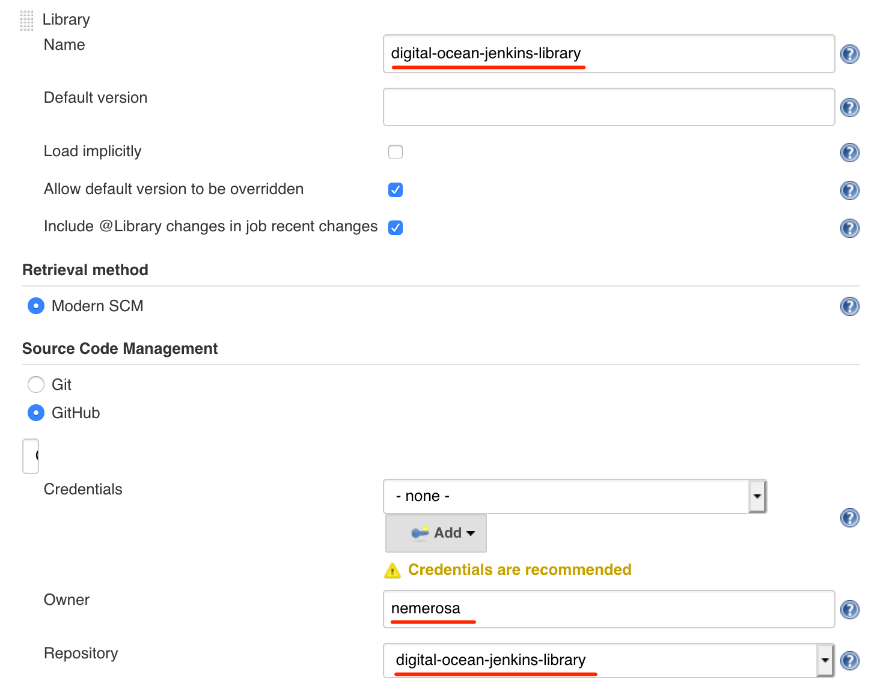

Digital Ocean Jenkins Library
=============================

[Jenkins pipeline library](https://jenkins.io/doc/book/pipeline/shared-libraries/) for using [Digital Ocean](https://www.digitalocean.com/).

It provides some tasks to interact with Digital Ocean services like Kubernetes clusters, load balancers, etc.

> It's a very early version. While provided steps *do* work, only very few features are covered.

## Table of contents

* [Examples](#examples)
* [Steps](#steps)
* [Authentication](#authentication)
* [Prerequisites](#prerequisites)
* [Installation](#installation)
* [Contributing](#contributing)

## Examples

### Creating a cluster for running some tests

Given a `deployment.yaml` in the workspace, one can:

1. create a K8S cluster in Digital Ocean
1. apply the deployment in this cluster
1. wait for the service(s) to be available
1. run some tests
1. tear down the deployment
1. remove the K8S cluster

This is achieved by running the following code in your `Jenkinsfile`:

```groovy
withDigitalOceanK8SCluster(
        logging: true,
        credentials: "MY_DO_CREDENTIALS",
        name: "jenkins-${env.BUILD_NUMBER}",
        region: "ams3",
        version: "1.13.1-do.2",
        pools: [[
          name : "jenkins-${env.BUILD_NUMBER}"
          count: 2,
          size : "s-1vcpu-2gb"
        ]]
) { cluster ->
    withDeployment(file: "deployment.yaml") {
        waitForDigitalOceanLoadBalancer(
                service: "my-service",
                outputVariable: "MY_SERVICE_IP",
                logging: true,
        )
        echo "Service IP = ${env.MY_SERVICE_IP}"
        // Runs the tests against load balancer at MY_SERVICE_IP
    }
    // Here, the deployment has been deleted
}
// Here, the cluster has been destroyed
```

## Steps

### Digital Ocean specific tasks

* [`withDigitalOceanK8SCluster`](vars/withDigitalOceanK8SCluster.md) - creates a [Digital Ocean Kubernetes cluster](https://www.digitalocean.com/products/kubernetes/) and allows some code to run against it.
* [`waitForDigitalOceanLoadBalancer`](vars/waitForDigitalOceanLoadBalancer.md) - waits for a [Digital Ocean load balancer](https://www.digitalocean.com/products/load-balancer/) created by a service to be ready.

### K8S steps

* [`withDeployment`](vars/withDeployment.md) - deploying (and undeploying) a K8S file

## Authentication

In tasks where the [Digital Ocean API](https://developers.digitalocean.com/documentation/) is accessed, a [Personal Access Token](https://cloud.digitalocean.com/account/api/tokens) must be provided and stored as a Jenkins credentials entry accessible by your pipeline or job. The type of the credentials must be "Secret Text" and the ID of the credentials entry will be used as the `credentials` parameter of the step.

## Prerequisites

## Installation

Before being used by your pipeline definitions, this library must be registered in your Jenkins installation.

Using the Jenkins management interface, you can declare this library the following way:



> Refer to the [Jenkins documentation](https://jenkins.io/doc/book/pipeline/shared-libraries/) to know how to perform this registration.

You can also use [Jenkins Configuration as Code](https://github.com/jenkinsci/configuration-as-code-plugin/blob/master/README.md):

```YAML
unclassified:
  globallibraries:
    libraries:
      - name: "digital-ocean-jenkins-library"
        retriever:
          modernSCM:
            scm:
              github:
                repoOwner: "nemerosa"
                repository: "digital-ocean-jenkins-library"
```

When the library is registered, you can use it in your `Jenkinsfile`s:

```groovy
@Library("digital-ocean-jenkins-library@master") _
```

## Contributing
